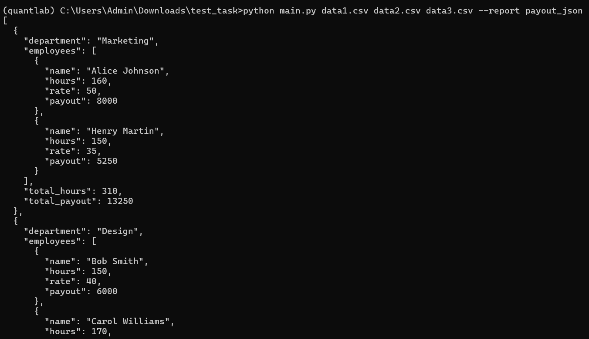

# Payout report script

Скрипт для формирования отчетов по зарплате сотрудников на Python.

# Возможности

- Чтение одного или нескольких CSV-файлов с произвольным порядком и названиями колонок.
- Поддержка ставок: `hourly_rate`, `rate`, `salary`.
- Группировка сотрудников по отделам.
- Итоговые часы и сумма выплат по каждому отделу, аккуратное выравнивание итогов.
- Поддержка вывода как в табличном виде, так и в формате JSON.
- Обработка ошибок пользователя (отсутствие файла, неизвестный тип отчёта, некорректный CSV).
- Чистая архитектура: добавить новый отчёт — просто создать функцию и прописать её в реестр.
- Аннотации типов.
- Тесты на pytest покрывают критически важный функционал.

# Получить табличный отчёт
python main.py data1.csv data2.csv --report payout

# Получить JSON-отчёт
python main.py data1.csv data2.csv --report payout_json

# Добавление нового отчёта

1. Создайте функцию в `reports.py`, которая принимает список сотрудников и возвращает строку-отчёт.
2. Добавьте её в словарь `REPORTS` в `main.py`, указав ключ для запуска (например, `'avg_rate': avg_rate_report`).
3. Теперь отчёт доступен по ключу:  
   `python main.py ... --report avg_rate`

# Запуск теста
Если используете Windows и тесты не видят модули, используйте  
`set PYTHONPATH=.`  
После запуск pytest.

   
